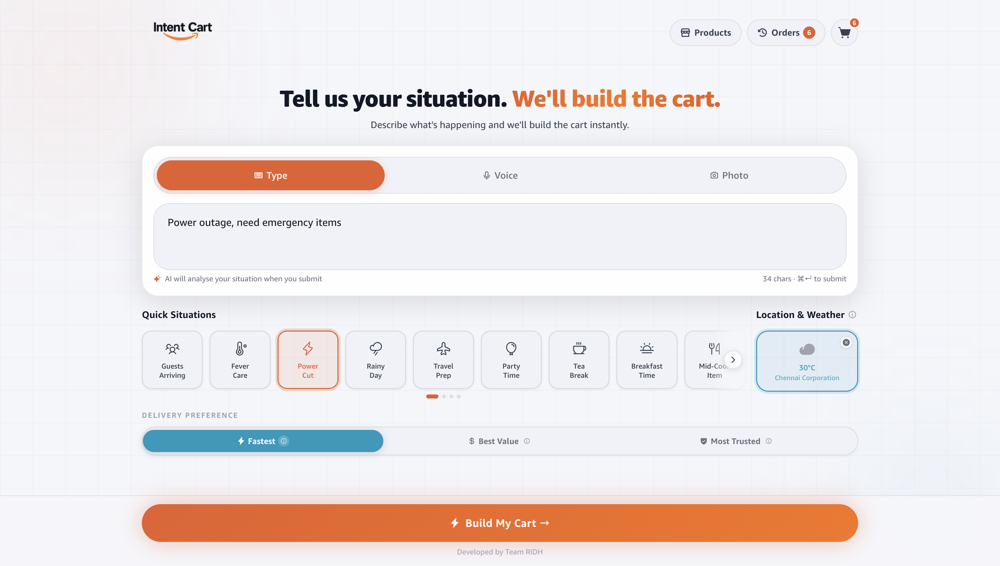
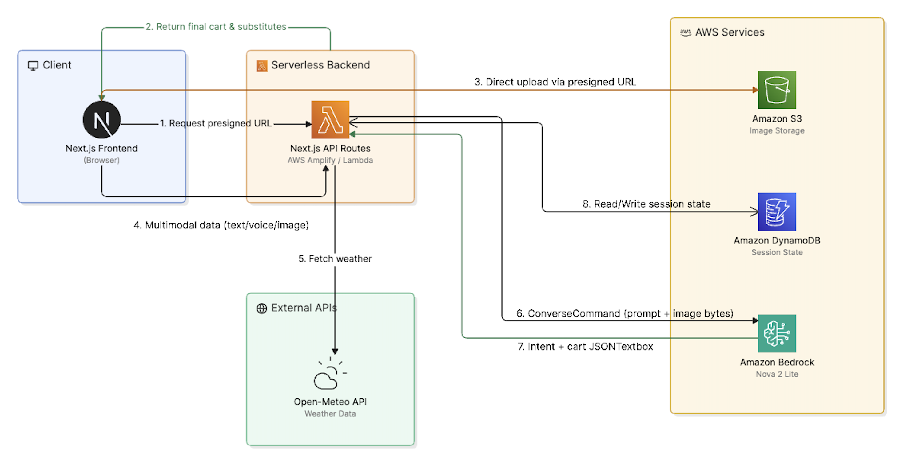

# Intent Cart

> Tell us your situation. We'll build the cart.

Intent Cart is an AI-powered quick-commerce app that skips traditional browsing. Describe what's happening — *"Guests arriving in 30 minutes"* or *"Feeling sick, need medicines"* — and the AI instantly builds a personalized shopping cart.



---

## Problem & Solution

Shopping apps make you search for individual items. But people don't think in products — they think in situations. Intent Cart flips the model: describe your *situation*, and AI handles the rest — scenario classification, product selection, urgency scoring, and substitute ranking.

---

## Features

- **Natural language input** — type, speak, or upload a photo of your situation
- **AI intent parsing** — Amazon Bedrock (Nova 2 Lite) classifies 31 scenarios (fever, hosting, pooja, travel, power cut, and more)
- **Instant cart generation** — scenario-aware product selection from a catalog of 26+ categories
- **3 urgency modes** — Fastest delivery, Best value, Most trusted brand
- **Substitute drawer** — ranked alternatives per item, auto-selected by urgency mode
- **AI cart refinement** — chat-style edits: *"remove the soup"* or *"I already have Vicks"*
- **Location & weather signals** — real-time weather via Open-Meteo influences scenario confidence
- **Photo upload** — multimodal analysis via S3 + Bedrock vision
- **Voice input** — Web Speech API transcription
- **Re-order chip** — one-tap repeat of last confirmed situation
- **Session persistence** — DynamoDB-backed sessions with 7-day cookie
- **Offline detection** — banner warns before submission on network loss
- **Low-confidence clarification** — modal prompts user to confirm when AI is < 65% confident

---

## Tech Stack

| Layer | Technology |
|---|---|
| Framework | Next.js 16 (App Router, SSR) |
| UI | React 19, Phosphor Icons, Framer Motion |
| State | Zustand |
| AI | Amazon Bedrock — Amazon Nova 2 Lite (multimodal) |
| Database | AWS DynamoDB (session storage) |
| Storage | AWS S3 (photo uploads) |
| Weather | Open-Meteo API (free, no key) |
| Geocoding | Nominatim / OpenStreetMap |
| Hosting | AWS Amplify Gen 1 |
| CI/CD | GitHub Actions |
| Language | TypeScript |

---

## System Architecture



**Flow:**

1. User describes situation (text / voice / photo)
2. `/api/interpret` sanitizes input, calls Bedrock with time + weather + location context
3. Bedrock classifies scenario, returns JSON intent with confidence score
4. Server generates cart from product catalog using scenario rules
5. Session saved to DynamoDB; cart returned to client
6. User can refine urgency mode, swap substitutes, edit via AI, or proceed to checkout

---

## Quick Start

### Prerequisites

- Node.js 20+
- AWS account with Bedrock, DynamoDB, and S3 access

### Installation

```bash
git clone https://github.com/your-org/intent-cart.git
cd intent-cart
npm install
cp .env.example .env.local
```

Edit `.env.local` with your AWS credentials (see [Environment Variables](#environment-variables)).

```bash
npm run dev
# → http://localhost:3000
```

---

## Environment Variables

```env
# AWS credentials (use BEDROCK_ prefix — AWS_ is reserved by Amplify)
BEDROCK_ACCESS_KEY_ID=
BEDROCK_SECRET_ACCESS_KEY=
BEDROCK_REGION=us-east-1

# Bedrock model
BEDROCK_MODEL_ID=us.amazon.nova-2-lite-v1:0

# DynamoDB table name
DYNAMO_TABLE=intent-cart-sessions

# S3 bucket for photo uploads
S3_BUCKET=intent-cart-uploads-{accountId}

# Public config
NEXT_PUBLIC_APP_NAME=Intent Cart
NEXT_PUBLIC_S3_REGION=us-east-1
NEXT_PUBLIC_S3_BUCKET=intent-cart-uploads-{accountId}
```

### AWS Setup

**DynamoDB** — create a table `intent-cart-sessions` with:
- Partition key: `sessionId` (String)
- TTL attribute: `expiresAt`
- Billing: PAY_PER_REQUEST

**S3** — create a bucket `intent-cart-uploads-{accountId}` with CORS configured to allow PUT from your domain.

**IAM permissions** required:
- `bedrock:InvokeModel`
- `dynamodb:GetItem`, `PutItem`, `UpdateItem`
- `s3:PutObject`, `s3:GetObject`

---

## Project Structure

```
app/
  page.tsx              # Home — situation input
  cart/page.tsx         # Cart view
  checkout/page.tsx     # Checkout confirmation
  history/page.tsx      # Order history
  products/page.tsx     # Product browser
  api/
    interpret/          # POST — Bedrock intent parsing + cart generation
    cart/               # GET/POST/PATCH — cart CRUD
    cart/refine/        # POST — AI cart editing
    cart/browse/        # GET — product browsing
    weather/            # GET — Open-Meteo weather
    upload/             # POST — S3 presigned URL
    checkout/confirm/   # POST — order confirmation
    reorder/            # GET — last confirmed session

components/
  CartItemCard          # Individual cart item with qty controls
  SubstituteDrawer      # Ranked substitute picker
  ContextSignals        # Location & weather chip
  VoiceCapture          # Speech-to-text input
  PhotoUpload           # S3 image upload
  SituationChips        # Quick-select scenario chips
  UrgencyBar            # Fastest / Value / Trusted toggle

lib/
  ai/
    intentParser        # Client → /api/interpret bridge
    cartGenerator       # Scenario → product selection logic
    substituteRanker    # Urgency-aware substitute sorting
  data/products/        # 26 product category catalogs
  db/                   # DynamoDB client + session helpers
  storage/              # S3 client + presigner

store/
  cartStore             # Zustand store — cart, intent, session sync

hooks/
  useContextSignals     # Location + weather fetching
  useSpeechRecognition  # Web Speech API wrapper
  useImageUpload        # S3 upload flow
```

---

## Deployment

Deployed via **AWS Amplify Gen 1**. On push to `main`, Amplify builds and deploys automatically.

The `amplify.yml` injects server-side env vars into `.env.production` at build time so they're available in SSR Lambda functions at runtime.

GitHub Actions (`deploy-status.yml`) monitors the Amplify build and reports pass/fail status back to the PR.

---

## API Reference

| Method | Endpoint | Description |
|---|---|---|
| `POST` | `/api/interpret` | Parse situation, invoke Bedrock, generate cart |
| `GET` | `/api/cart` | Load session cart |
| `POST` | `/api/cart` | Generate cart for existing session |
| `PATCH` | `/api/cart` | Update urgency, qty, substitutes, add/remove items |
| `POST` | `/api/cart/refine` | AI-powered cart editing via natural language |
| `GET` | `/api/cart/browse` | Browse products by category |
| `POST` | `/api/upload` | Get S3 presigned URL for photo upload |
| `GET` | `/api/weather` | Get current weather by coordinates |
| `POST` | `/api/checkout/confirm` | Confirm order and mark session complete |
| `GET` | `/api/reorder` | Fetch last confirmed session for re-order |

---

## Team

Built by **Team RIDH**

---

*Product images and data are sourced from a public dataset and may not be 100% accurate.*
